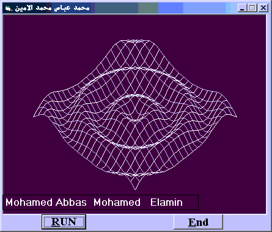



## A   ' Curve of 3D Dynamic plotting Grid '

### Description

.ÈÓã ÇááÉ ÇáÑÍãä ÇáÑÍíã ((REVIEWED))Hi Guys ! This is a nice cool project ..which is an assimilation to the (3D Wave Grid) project which was pretty complicated ,but this one that i wrote has an uncredible simple easy code ...(NOTE) :This project could easily be modified to be a (3D Plotting Curve Function) able to be smoothly dynamic....PLS.. (VOTE ME)......My E-mail is mohamedabbas_us@yahoo.com
 
### More Info
 
Do not Run any program beside this one otherwise the output screen will flicker

             |
---                |---
**Submitted On**   |2002-06-08 02:00:52
**By**             |[Mohamed Abbas Mohamed](https://github.com/Planet-Source-Code/PSCIndex/blob/master/ByAuthor/mohamed-abbas-mohamed.md)
**Level**          |Advanced
**User Rating**    |4.8 (81 globes from 17 users)
**Compatibility**  |VB 3\.0, VB 4\.0 \(16\-bit\), VB 4\.0 \(32\-bit\), VB 5\.0, VB 6\.0, VBA MS Excel
**Category**       |[Math/ Dates](https://github.com/Planet-Source-Code/PSCIndex/blob/master/ByCategory/math-dates__1-37.md)
**World**          |[Visual Basic](https://github.com/Planet-Source-Code/PSCIndex/blob/master/ByWorld/visual-basic.md)
**Archive File**   |[A\_\_\_'\_Curv91640672002\.zip](https://github.com/Planet-Source-Code/mohamed-abbas-mohamed-a-curve-of-3d-dynamic-plotting-grid__1-31724/archive/master.zip)

